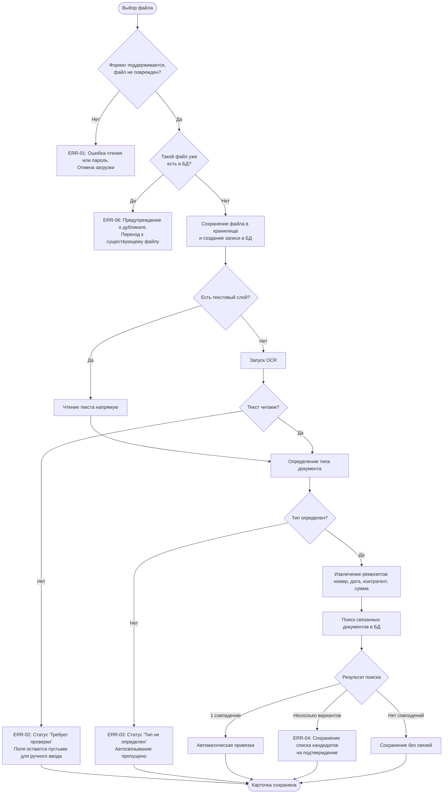
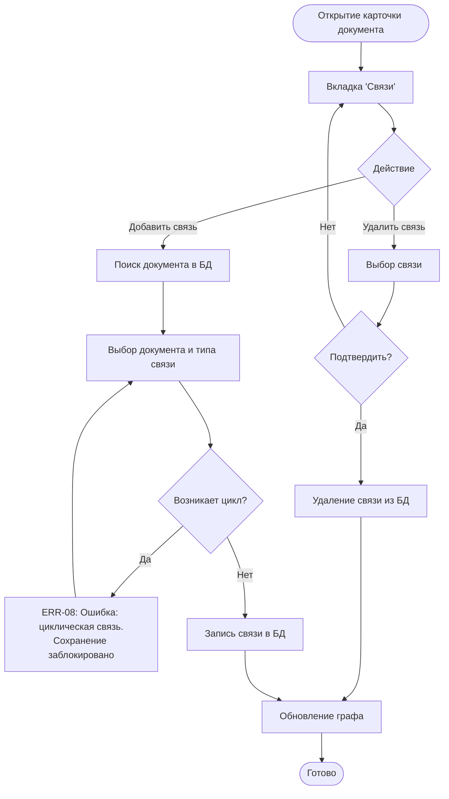
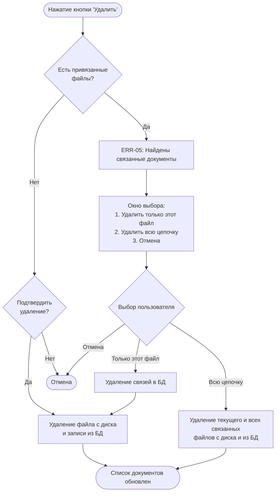

# Схемы основных процессов

## 1. Загрузка и обработка документа

```mermaid
flowchart TD
    Start([Выбор файла]) --> CheckFormat{Формат поддерживается,<br/>файл не поврежден?}
    
    CheckFormat -- Нет --> Err01[ERR-01: Ошибка чтения или пароль.<br/>Отмена загрузки]
    
    CheckFormat -- Да --> CheckDuplicate{Такой файл уже<br/>есть в БД?}
    CheckDuplicate -- Да --> Err06[ERR-06: Предупреждение о дубликате.<br/>Переход к существующему файлу]
    
    CheckDuplicate -- Нет --> SaveLocal[Сохранение файла в хранилище<br/>и создание записи в БД]
    SaveLocal --> HasTextLayer{Есть текстовый слой?}
    
    HasTextLayer -- Да --> ExtractDirect[Чтение текста напрямую]
    HasTextLayer -- Нет --> RunOCR[Запуск OCR]
    
    RunOCR --> OCRConfidence{Текст читаем?}
    ExtractDirect --> DocClassification[Определение типа документа]
    
    OCRConfidence -- Нет --> Err02[ERR-02: Статус 'Требует проверки'<br/>Поля остаются пустыми для ручного ввода]
    Err02 --> Ready([Карточка сохранена])
    
    OCRConfidence -- Да --> DocClassification
    DocClassification --> TypeKnown{Тип определен?}
    
    TypeKnown -- Нет --> Err03[ERR-03: Статус 'Тип не определен'<br/>Автосвязывание пропущено]
    Err03 --> Ready
    
    TypeKnown -- Да --> ExtractAttributes[Извлечение реквизитов:<br/>номер, дата, контрагент, сумма]
    ExtractAttributes --> MatchRelations[Поиск связанных документов в БД]
    
    MatchRelations --> MatchResult{Результат поиска}
    MatchResult -- 1 совпадение --> CreateAutoLink[Автоматическая привязка]
    MatchResult -- Несколько вариантов --> Err04[ERR-04: Сохранение списка кандидатов<br/>на подтверждение]
    MatchResult -- Нет совпадений --> StandaloneDoc[Сохранение без связей]
    
    CreateAutoLink --> Ready
    Err04 --> Ready
    StandaloneDoc --> Ready
```

---

## 2. Ручное управление связями

```mermaid
flowchart TD
    OpenDoc([Открытие карточки документа]) --> ViewGraph[Вкладка 'Связи']
    ViewGraph --> UserAction{Действие}
    
    UserAction -- Удалить связь --> SelectLink[Выбор связи]
    SelectLink --> ConfirmDeleteLink{Подтвердить?}
    ConfirmDeleteLink -- Да --> DeleteDBLink[Удаление связи из БД]
    DeleteDBLink --> UpdateView[Обновление графа]
    ConfirmDeleteLink -- Нет --> ViewGraph
    
    UserAction -- Добавить связь --> SearchTarget[Поиск документа в БД]
    SearchTarget --> SelectTarget[Выбор документа и типа связи]
    SelectTarget --> CheckCycle{Возникает цикл?}
    
    CheckCycle -- Да --> Err08[ERR-08: Ошибка: циклическая связь.<br/>Сохранение заблокировано]
    Err08 --> SelectTarget
    
    CheckCycle -- Нет --> SaveNewLink[Запись связи в БД]
    SaveNewLink --> UpdateView
    UpdateView --> DoneAction([Готово])
```

---

## 3. Удаление документа

```mermaid
flowchart TD
    StartDelete([Нажатие кнопки 'Удалить']) --> CheckLinks{Есть привязанные<br/>файлы?}
    
    CheckLinks -- Нет --> SimpleConfirm{Подтвердить<br/>удаление?}
    SimpleConfirm -- Да --> PhysicalDelete[Удаление файла с диска<br/>и записи из БД]
    SimpleConfirm -- Нет --> CancelDelete([Отмена])
    
    CheckLinks -- Да --> Err05[ERR-05: Найдены связанные документы]
    Err05 --> ShowDialog[Окно выбора:<br/>1. Удалить только этот файл<br/>2. Удалить всю цепочку<br/>3. Отмена]
    
    ShowDialog --> Decision{Выбор пользователя}
    
    Decision -- Отмена --> CancelDelete
    
    Decision -- Только этот файл --> UnlinkChildren[Удаление связей в БД]
    UnlinkChildren --> PhysicalDelete
    
    Decision -- Всю цепочку --> DeleteAll[Удаление текущего и всех связанных<br/>файлов с диска и из БД]
    
    PhysicalDelete --> DoneDelete([Список документов обновлен])
    DeleteAll --> DoneDelete
```